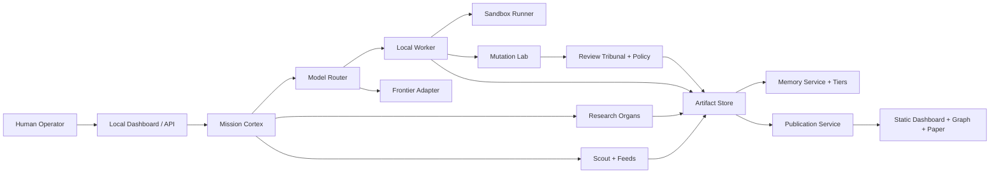

# Organism

Organism is a local-first operator kernel for building a research organism.

It combines bounded execution, artifact-first memory, live scouting, staged research workflows, mutation guardrails, promotion gates, social simulation, and a one-way public publication layer for GitHub.

## What It Is

Chimera Lab is not just a chatbot wrapper. It is a runtime for:

- creating `missions`, `programs`, and bounded `runs`
- routing work between local execution and frontier review
- persisting artifacts, reviews, memory records, and lineage outside chat
- scouting new repos, papers, and skill feeds
- running research pipelines, tree searches, fixed-budget research loops, and mutation experiments
- simulating social systems and venture structures
- publishing a public-safe dashboard, graph, and research paper without exposing the operator surface

## Core Idea

Everything important becomes an artifact.

Instead of relying on accumulated conversation history, Chimera Lab stores:

- run summaries
- review verdicts
- scout candidates
- memory records
- mutation promotions
- research traces
- publication bundles

That keeps the organism inspectable, resumable, and publishable.

## Architecture



## Upstream Research Influence

Chimera Lab borrows direction from several systems and papers:

- [DeerFlow](https://github.com/bytedance/deer-flow) for body, skills, sandbox, and local-first harness patterns
- [Ralph](https://github.com/snarktank/ralph) for fresh-context loops and bounded execution
- [EverMemOS](https://github.com/EverMind-AI/EverMemOS) and [MSA](https://github.com/EverMind-AI/MSA) for memory architecture direction
- [AgentLaboratory](https://github.com/SamuelSchmidgall/AgentLaboratory) and [AI-Scientist-v2](https://github.com/SakanaAI/AI-Scientist-v2) for staged research, tree search, and referee ideas
- [last30days-skill](https://github.com/mvanhorn/last30days-skill), [awesome-autoresearch](https://github.com/alvinunreal/awesome-autoresearch), and [Agent Skills Hub](https://agentskillshub.top/) for scout/feed discovery
- [autoresearch](https://github.com/karpathy/autoresearch), AVO-style mutation work, and [HyperAgents](https://github.com/facebookresearch/Hyperagents) for later evolution-lab direction
- [MiroFish](https://github.com/amadad/mirofish) for social simulation inspiration
- [Evolutionary Optimization of Model Merging Recipes](https://arxiv.org/abs/2403.13187) for merge-forge direction
- [turboquant](https://pypi.org/project/turboquant/) for future local compression

These systems shaped the architecture. This repository is its own implementation.

## Current Capability Map

### Operator Kernel

- mission, program, and run APIs
- local dashboard
- model routing
- local worker execution
- frontier planning and audit adapters
- artifact and review persistence
- policy decisions

### Research Organs

- staged research pipelines
- tree search
- fixed-budget autoresearch
- meta-improvement sessions
- model merge registry and merge records

### Memory and Scout

- basic memory store and search
- memory tiers with linking and promotion
- seeded scout ingestion
- live GitHub and arXiv search
- first-class scout feed sync

### Mutation and Safety

- model-generated structured diffs
- isolated candidate workspaces
- guardrail quarantine
- second-layer review artifacts
- separation-of-duties promotion gate

### Simulation and Company Layer

- simple Vivarium world stepping
- multi-agent social Vivarium
- venture and product asset simulation
- owner approvals and treasury movement

### Publication Layer

- public research bundle JSON
- public graph JSON
- generated research paper in Markdown and HTML
- static GitHub Pages-ready dashboard and graph

### Backup and Crash Recovery

- git repository bootstrap and checkpoint endpoints
- automatic checkpoint on public export
- automatic checkpoint on mutation promotion
- optional mirror-remote push for backup redundancy
- timestamped backup tags for immutable restore points
- runtime event journal
- persisted crash reports and last-session recovery state

## Public Research Surface

The public site is read-only and outward-facing.

- [Public dashboard](./docs/index.html)
- [Interactive graph](./docs/graph.html)
- [Research paper](./docs/papers/chimera-lab-research-synthesis.html)
- [Publication design notes](./docs/PUBLICATION.md)

The publication layer is intentionally one-way:

- it reads organism state
- it redacts obvious local-only details
- it writes static output into `docs/`
- it does not create a control path from the web back into the organism

## Repository Layout

```text
chimera_lab/
  app.py
  config.py
  db.py
  schemas.py
  services/
  static/
docs/
  index.html
  graph.html
  dashboard.js
  graph.js
  style.css
  papers/
skills/
tests/
scripts/
```

## Quick Start

```bash
python -m venv .venv
.venv\Scripts\activate
pip install -e .[dev]
organism run
```

Open the local operator UI at [http://127.0.0.1:8000](http://127.0.0.1:8000).

You can also use:

```bash
python organism.py run
```

or:

```bash
python -m chimera_lab run
```

### Recommended Local Run Mode

You do not need cloud API keys to run the organism locally.

PowerShell:

```powershell
organism run
```

That starts the safe autonomous mode by default:

- supervisor enabled
- background arXiv ingestion enabled
- local Ollama execution enabled
- frontier provider set to `manual` unless you override it
- local model defaulted to `qwen3.5:9b` unless you override it
- no `--reload`, so the organism does not restart itself while writing runtime files

Useful overrides:

```powershell
organism run --model qwen2.5-coder:7b
organism run --frontier-provider openai
organism dev
```

### When API Keys Are Actually Needed

You only need `OPENAI_API_KEY` or `GEMINI_API_KEY` if you want automated frontier planning or auditing.

Recommended practice:

- set keys in your shell session or Windows user environment
- do not put live keys in tracked files
- do not put live keys in `.env` files inside this repo
- keep `CHIMERA_FRONTIER_PROVIDER=manual` unless you explicitly want automated cloud review

## Export the Public Site

Generate the GitHub-facing research bundle:

```bash
python scripts/export_public_site.py
```

This writes:

- `docs/data/latest.json`
- `docs/data/graph.json`
- `docs/papers/chimera-lab-research-synthesis.md`
- `docs/papers/chimera-lab-research-synthesis.html`

The organism also attempts a git checkpoint after public export when auto-push is enabled.

## Deploy to GitHub Pages

The repository includes a Pages workflow:

- [publish-pages.yml](./.github/workflows/publish-pages.yml)

It deploys the `docs/` directory as a static site on pushes to `main` or `master`, or via manual dispatch.

## Documentation

- [Architecture](./docs/ARCHITECTURE.md)
- [API](./docs/API.md)
- [Operations](./docs/OPERATIONS.md)
- [Publication](./docs/PUBLICATION.md)

## Environment Variables

- `CHIMERA_DATA_DIR`: runtime data directory, defaults to `./data`
- `CHIMERA_OLLAMA_URL`: Ollama API base URL, defaults to `http://127.0.0.1:11434`
- `CHIMERA_LOCAL_MODEL`: local worker model name, defaults to `qwen2.5-coder:7b`
- `CHIMERA_ENABLE_OLLAMA`: `1` to attempt live local-model calls
- `CHIMERA_SANDBOX_MODE`: `local` or `docker`
- `CHIMERA_SKILLS_DIR`: markdown skill directory
- `CHIMERA_GIT_ROOT`: git working tree root, defaults to the current repo
- `CHIMERA_GIT_REMOTE_URL`: remote repository URL, defaults to `https://github.com/gauravshajepal-hash/Organism.git`
- `CHIMERA_GIT_MIRROR_REMOTE_URL`: optional second remote for redundant backup pushes
- `CHIMERA_GIT_MIRROR_REMOTE_NAME`: remote name for the mirror, defaults to `mirror`
- `CHIMERA_GIT_BRANCH`: push branch, defaults to `main`
- `CHIMERA_GIT_AUTOPUSH`: enable automatic git push checkpoints
- `CHIMERA_GIT_SECRET_SCAN`: block checkpoints when staged files or staged diffs look secret-bearing
- `CHIMERA_GIT_BACKUP_TAGS_ENABLED`: create timestamped backup tags on successful backup pushes
- `CHIMERA_GIT_BACKUP_TAG_PREFIX`: prefix for backup tags, defaults to `backup`
- `CHIMERA_GIT_BACKUP_INTERVAL_SECONDS`: force a backup verification push/tag when the last recorded backup is stale
- `CHIMERA_LOCAL_RETRY_LIMIT`: retry-command fan-out for local runs
- `CHIMERA_SCOUT_SEEDS`: comma-separated scout seed URLs
- `CHIMERA_MUTATION_MAX_FILES`: maximum edited files before quarantine
- `CHIMERA_MUTATION_MAX_CHANGED_LINES`: maximum changed diff lines before quarantine
- `CHIMERA_MUTATION_REVIEW_MIN_CONFIDENCE`: minimum confidence for promotion review
- `CHIMERA_FRONTIER_PROVIDER`: `manual`, `auto`, `openai`, or `gemini`
- `CHIMERA_FRONTIER_MODEL`: model name for OpenAI-compatible frontier calls
- `CHIMERA_FRONTIER_BASE_URL`: OpenAI-compatible base URL
- `OPENAI_API_KEY`: enables automated frontier calls for provider `openai`
- `GEMINI_API_KEY`: enables automated frontier calls for provider `gemini`
- `CHIMERA_GEMINI_MODEL`: Gemini model name

## Safety Model

- local execution runs in bounded workspaces
- risky mutations are quarantined
- mutations cannot enter accepted lineage directly
- promotion requires a promotive second-layer review and explicit approval
- the reviewer must be distinct from the generator by reviewer type or model tier
- runtime events and crashes are journaled under `data/runtime`
- the next startup can inspect the latest crash and recent events
- important outward-facing checkpoints can auto-commit and push
- checkpoints can push to both `origin` and an optional mirror remote
- successful backup pushes can stamp immutable timestamped tags
- secret-bearing files and obvious staged credentials are blocked before checkpoint commit/push
- public export is outward-only and redacted

## Verification

```bash
python -m pytest
python -m compileall chimera_lab
```
